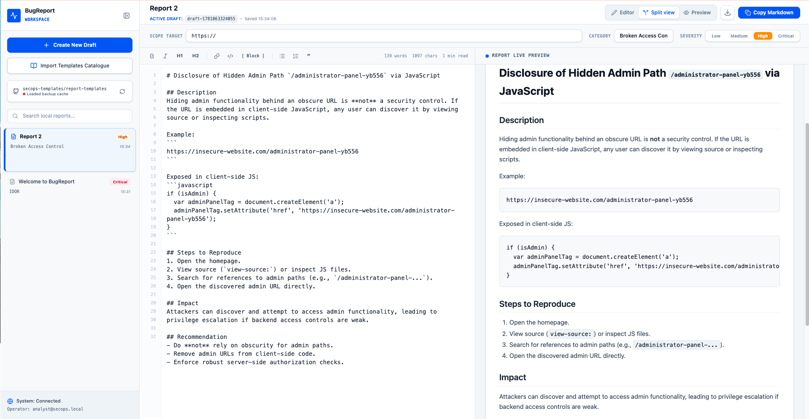

# BugReport 🚀

A highly polished, professional Single Page Application designed for SecOps professionals and bug hunters to draft, build, refine, and catalogue security vulnerability reports in clean, compliance-grade formats.

This project delivers a responsive client dashboard with interactive Markdown sidebars, category tracking, severity selectors, sync backups, and template headers. 



---

## 🐋 Docker Installation & Setup

This containerized environment features a micro-sized **multi-stage build** configured with a lightweight **Nginx Alpine production server**, optimized with gzip compression and robust fallback routing tailored for single-page React architectures.

### 📋 Prerequisites
Make sure you have the following software installed:
*   [Docker Desktop](https://www.docker.com/products/docker-desktop) (v20.10.0 or higher)
*   [Docker Compose](https://docs.docker.com/compose/install/) (v2.0.0 or higher)

---

## ⚡ Quick Start: Compose (Recommended)

Docker Compose is the fastest way to spin up the container with optimized configurations.

1. **Build and start the container** in detached mode:
   ```bash
   docker compose up --build -d
   ```

2. **Access the Application**:
   Open your browser of choice and navigate to:
   ```
   http://localhost:8080
   ```

3. **Stop & Turn Down Services**:
   ```bash
   docker compose down
   ```

---

## 🛠️ Alternate Option: Standard Docker CLI

If you prefer to work with Docker commands directly instead of Compose, use the commands below.

### 1. Build the Docker Image
```bash
docker build -t bugreport:latest .
```

### 2. Run the Container
```bash
docker run -d \
  --name bugreport \
  -p 8080:80 \
  --restart unless-stopped \
  bugreport:latest
```

### 3. Check Logs
```bash
docker logs -f bugreport
```

### 4. Stop the Container
```bash
docker stop bugreport
docker rm bugreport
```

---

## ⚙️ Configuration details

*   **Port Mapping**: By default, the app is exposed on host port `8080`. To customize the host port, open `docker-compose.yml` and modify the ports configuration (e.g. `"3000:80"` to serve on port `3000`).
*   **Security Precautions**: The Compose config enforces `no-new-privileges:true` as a defense-in-depth container containment standard.
*   **SPA Support**: The production container copies a specialized `nginx.conf` routing all unresolved assets back to standard `index.html` seamlessly. This ensures you can scale route architectures inside React without triggering `404 Not Found` responses from Nginx.

---

## 📂 Project Structure under Docker
```yaml
.
├── Dockerfile              # Optimizing build execution stages (Node building -> Nginx deployment)
├── nginx.conf              # SPA-configured Nginx routing parameters & gzip controls
├── docker-compose.yml      # Declarative service deployment specification
├── .dockerignore           # Eliminates container bloat and prevents target context pollution
└── README.md               # User guide & operations manual
```

---

## 🔧 Troubleshooting

### 1. Port 8080 is already in use
If another application or container has bound to port `8080`, stop the container and edit your `docker-compose.yml` ports pairing:
```yaml
ports:
  - "9000:80"  # Change outer port to 9000, keep inner port 80 untouched
```
Then run:
```bash
docker compose up -d
```

### 2. Seeing outdated files after system updates
To force Docker to rebuild your static workspace without using any cached installation layers, clear the cache cleanly using:
```bash
docker compose build --no-cache
docker compose up -d
```
